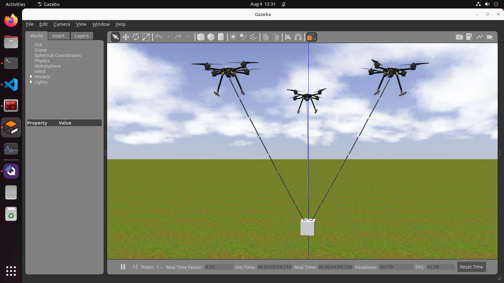
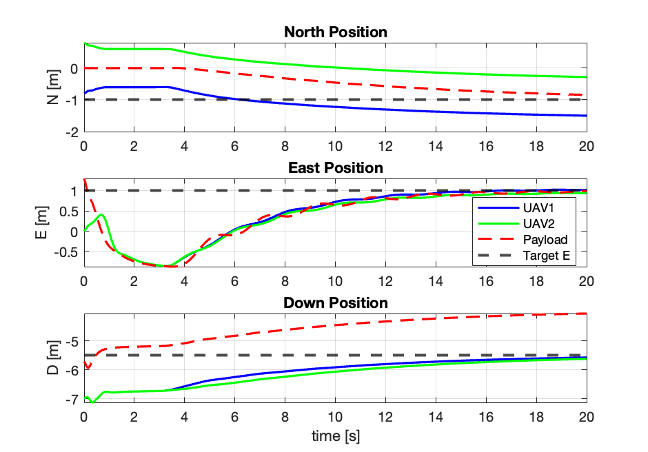
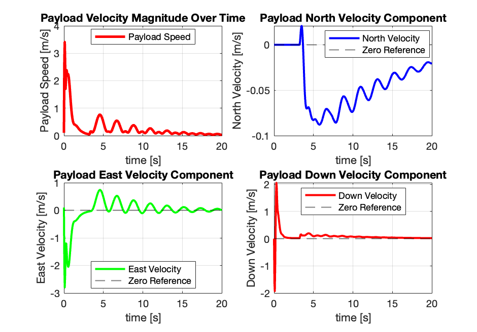
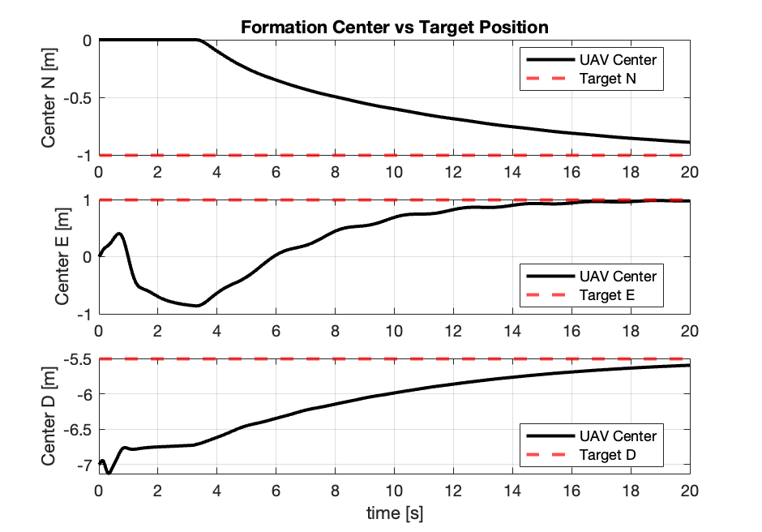
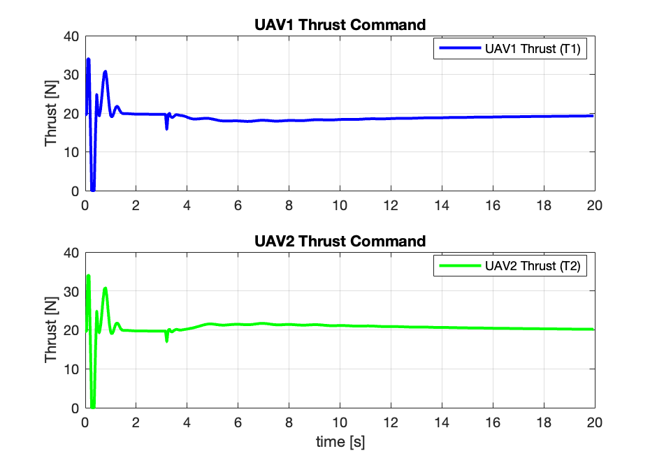
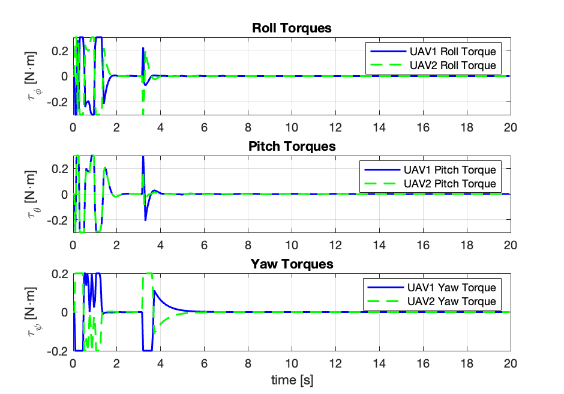

<div align="center">

# 🚁 Multi-UAV Cooperative Payload Transportation
## Nonlinear Model Predictive Control (NMPC) Framework

[](https://docs.ros.org/en/humble/)
[](https://px4.io/)
[](https://isocpp.org/)
[](https://www.python.org/)
[](https://www.mathworks.com/)
[](https://classic.gazebosim.org/)
[](https://web.casadi.org/)

### 🎓 Master's Thesis Project | Advanced Robotics & Control Systems

</div>

---

## 🎯 Project Vision

> **Enabling autonomous multi-UAV systems to cooperatively transport suspended payloads even after failure of a Uav while maintaining stability, safety, and trajectory tracking.**

This repository represents my Master's thesis implementation combining **advanced control theory**, **optimization**, and **distributed robotics** trying to solve one of aerial robotics most challenging problems of cooperative payload transportation with multiple UAVs.

**This project extends the research work of** **[Dr. Andrea Delbene](https://rubrica.unige.it/personale/UUJGWFlo)** and **[Prof. Marco Baglietto](https://scholar.google.com/citations?user=ztDKjvYAAAAJ&hl=it)** (University of Genoa) on cable tension modeling and recovery techniques for multi-UAV systems, advancing their methodologies with enhanced NMPC control strategies and failure recovery mechanisms.

---

## 🎥 Thesis Defense & Documentation

<table>
<tr>
<td width="60%">

[](https://www.youtube.com/watch?v=b6rYaiWi52o)

*Click to watch the complete thesis defense presentation.*

</td>
<td width="40%">

### 📄 Slides & Reports

<br>

[](https://raw.githubusercontent.com/AlvinIsac/NMPC_Multi_UAVs_Payload_System_Master_Thesis/main/Aggressive-Maneuver-Planning-and-Control-Multi-UAV-Alvin-Thesis.pdf)

[](https://raw.githubusercontent.com/AlvinIsac/UAV-PAYLOAD-MODEL-PREDICTIVE-CONTROL-REPORT/main/Alvin_Isac_Master_Thesis.pdf)

<br>

*Complete technical documentation and presentation slides available for download*

</td>
</tr>
</table>

---

## 💻 Simulation Setup

<div align="center">

The system is simulated in Gazebo Classic with 3 UAVs cooperatively transporting a suspended payload via cables.

| **Front View** | **Top View** |
|:---:|:---:|
|  |  |

</div>

---

## 🌟 What Makes This Special?

<table>
<tr>
<td width="33%" align="center">
<h3>🎯 NMPC</h3>
<p>30 Hz control loop with 30-state nonlinear optimization running on standard hardware</p>
</td>
<td width="33%" align="center">
<h3>🔄 Adaptive Controller</h3>
<p>Controller activates upon UAV failure, minimizing computational load and change its phase to track trajectory while ensuring Uav and payload stabilization.</p>
</td>
<td width="33%" align="center">
<h3>⚡ Aggressive Stabilization</h3>
<p>Trajectory tracking while maintaining payload stability and cable tension constraints</p>
</td>
</tr>
</table>

---

## 📊 Performance Highlights

<div align="center">

### **Experimental Results from Simulation**

</div>

<div align="center">

| **Position Control** | **Attitude Stabilization** |
|:---:|:---:|
|  |  |
|  |

</div>

<div align="center">

| **Payload Velocity** | **UAV Formation** |
|:---:|:---:|
|  |  |


</div>

<div align="center">

| **Thrust Commands** | **Torques** |
|:---:|:---:|
|  |  |

</div>

---

## 🛠️ Technology Stack

<div align="center">

| **Domain** | **Technologies** |
|:---:|:---|
| 🎛️ **Control** | Nonlinear MPC, CasADi, IPOPT |
| 💻 **Programming** | C++17, Python, MATLAB, Bash |
| 🤖 **Robotics** | ROS2 Humble, PX4 Autopilot, MAVLink |
| 🌐 **Middleware** | DDS/RTPS, Micro XRCE-DDS |
| 🎮 **Simulation** | Gazebo Classic 11, Custom Physics Plugins |
| 📊 **Analysis** | MATLAB, Python (NumPy, Matplotlib) |
| 🔧 **Build Tools** | CMake, Colcon, Make |

</div>

---

## 📁 Repository Structure

```
NMPC_Multi_UAVs_Payload_System
│
├── 🎯 Mpc_Controller_c++/               # Real NMPC implementation
│   └── ros2_ws/                         # ROS2 workspace
│       └── src/mission_handler/         # Control nodes
│
├── 🌍 simulation_environment/           # Gazebo simulation setup*
│   └── src/
│       ├── mission_handler/             # Mission planning & state handling
│       ├── offboard_rtps/               # PX4 interface nodes
│       ├── joint_plugin/                # Custom Gazebo plugins
│       └── px4_msgs/                    # Message definitions
│
├── ✈️ PX4-Autopilot/                    # Modified firmware
│   ├── ROMFS/px4fmu_common/             # Custom airframes
│   └── Tools/simulation/                # SITL configurations
│
├── 🧮 Matlab_Discrete_version/          # MATLAB prototypes
├── 📊 Matlab-simulink_continuous/       # Simulink models
├── 📸 docs/Debug_imgs/                  # Debug imgs & results
├── 📝 Bash_Terminal_cmds/               # Launch scripts
└── 💾 Raw_sensor_data/                  # Experimental logs
```

---

## 🎓 Academic Context

**Program**: European Master's in Advanced Robotics.  
**Focus**: Cooperative Multi-Agent Systems, Optimal Control, Aerial Robotics  
**Duration**: 2024–2025  

### 🔬 Research Contributions

- ✅ A two-phase Nonlinear Model Predictive Control (NMPC) approach
- ✅ Fault-Tolerant Post-Failure Control Design  
- ✅ Comprehensive validation in high-fidelity simulation environments
- ✅ Improved mission robustness and safety under UAV failure scenarios

---

## 🙏 Acknowledgments

This work builds upon and extends the foundational research of **[Dr. Andrea Delbene](https://rubrica.unige.it/personale/UUJGWFlo)** and **[Prof. Marco Baglietto](https://scholar.google.com/citations?user=ztDKjvYAAAAJ&hl=it)**  from the University of Genoa. Their work on cable tension modeling and recovery techniques for multi-UAV payload transportation systems formed the basis for this thesis.

### 📚 Related Publications

1. **A. Delbene and M. Baglietto**, "Cables tension modeling for multi-UAV payload transportation," *Proc. 2024 IEEE 20th Int. Conf. on Automation Science and Engineering (CASE)*, pp. 212–218, IEEE, 2024.  
   [🔗 IEEE Xplore](https://ieeexplore.ieee.org/abstract/document/10711636)

2. **A. Delbene and M. Baglietto**, "Recovery techniques for a multi-UAV system transporting a payload," *Proc. 2024 IEEE 20th Int. Conf. on Automation Science and Engineering (CASE)*, pp. 559–566, IEEE, 2024.  
   [🔗 IEEE Xplore](https://ieeexplore.ieee.org/abstract/document/10711746)


---

## 📜 License and Authorship

This repository contains mixed academic material:

- **Simulation Framework**: Provided for thesis research purposes. Copyright remains with the respective original authors.

- **NMPC Controller Implementation** (MATLAB and C++): Including fault-tolerant logic and adaptive weight tuning — original work by **Alvin Isac** (2026), licensed under the **MIT License**.

---


## 📧 Contact details

<div align="center">

**👨‍🎓 Author**: Alvin Isac PREMSUNDER

**✉️ Mail**: alvinisac3399@gmail.com


</div>

---

<!-- <div align="center">

## ⭐ Star This Repository!

*If you find this work interesting or useful for your research, please consider giving it a star!*

**Made with 💙 by a passionate robotics engineer**

*Advancing the future of cooperative aerial robotics, one UAV at a time* 🚁✨

</div> -->